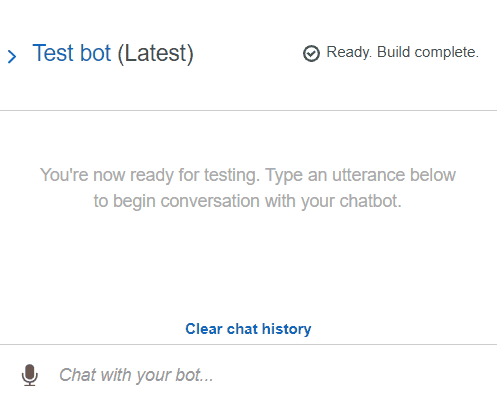
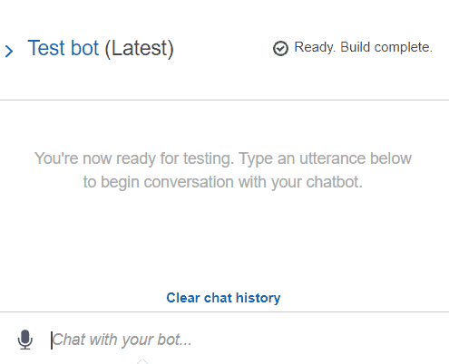
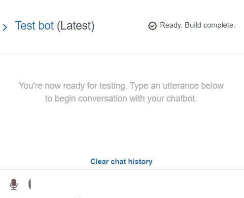

# AWS_RoboAdviser

A roboadviser that collects user details and recommends a portfolio.

Example of the working bot:

Example of the bot connected to Lambda code for recommendation:

Example of the bot with invalid user data:
